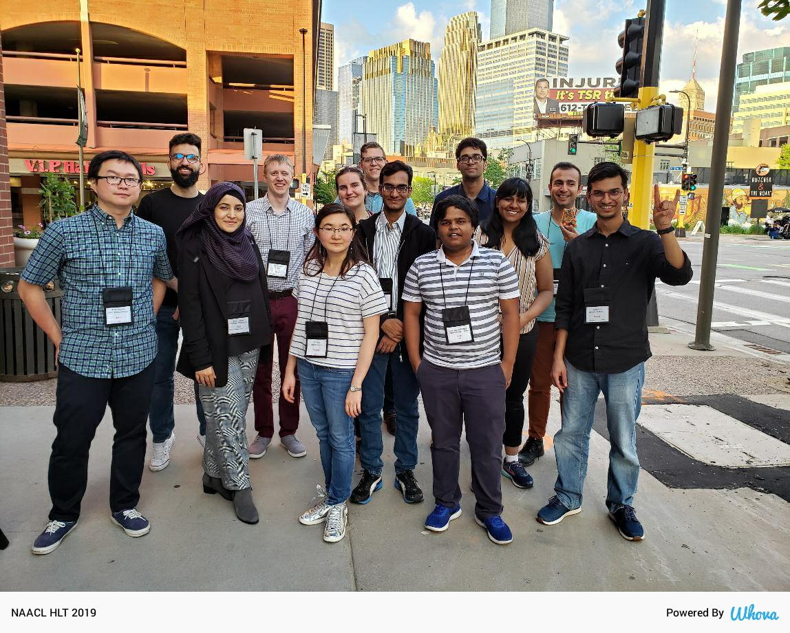

## Annoucement
Finally meet virtually everyone on Monday, June 7, 2021. See the updated [Workshop Schedule](https://2021.naacl.org/conference-program/srw/program.html)

List of all the [Accepted Paper](https://naacl2021-srw.github.io/accepted) (archival/non archival) is live now.

[Registration](https://2021.naacl.org/registration/) for the Virtual NAACL 2021 Conference is now open!
Early registration deadline: Thursday, May 20, 2021, 11:59 PM (EDT). More details on [NAACL 2021](https://2021.naacl.org/).  

NAACL D&I and SRW team present [Getting into NLP research and grad school applications](https://2021.naacl.org/blog/grad-school-panel/), kindly join us in the event, thanks.

# Welcome to NAACL SRW 2021
The NAACL Student Research Workshop (SRW) 2021 will be held in conjunction with [NAACL 2021](https://2021.naacl.org/) as a Virtual Workshop. The SRW gives student researchers in Computational Linguistics and Natural Language Processing the opportunity to present their work and receive constructive feedback and mentorship by experienced members of the ACL community. 

### Please find the accepted archival papers [here.](https://aclanthology.org/volumes/2021.naacl-srw/)

<!--  
 
_**Happy faces during the SRW Social in Minneapolis, Minnesota**_ -->

Contact us via email at [naacl2021-srw@googlegroups.com](mailto:naacl2021-srw@googlegroups.com) for any questions.
Get connected with us via [Facebook](https://www.facebook.com/naaclsrw2021) and [Twitter](https://twitter.com/naacl_srw).

<!-- We will update this site when latest information are available. -->

<!-- ### List of the accepted papers are available [here](/accepted) -->

<!-- # Differences from Past SRWs -->
Similar to past SRWs, NAACL 2021 SRW has two submission options archival (appear in proceedings), and non-archival (only for presentation). Authors can elect for both research papers and thesis proposals to be non-archival, in order to more explicitly encourage work in progress which can later be submitted to a future (archival) conference. These papers are otherwise treated the same as archival papers from a mentorship and reviewing standpoint. More details in the call for papers.

# Anti-Harassment Policy
The NAACL Student Research Workshop 2021 adheres to the [ACL anti-harassment policy](https://www.aclweb.org/adminwiki/index.php?title=Anti-Harassment_Policy). Please contact any current member of the [ACL Executive Committee](https://www.aclweb.org/portal/about) or [Priscilla Rasmussen](mailto:acl@aclweb.org) if you face any harassment or hostile behavior.

<!-- # Sponsored By        -->
<!-- 

 -->
<!-- 

 -->

