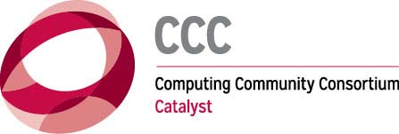
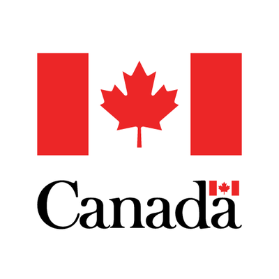

>The mission of the Computing Research Association’s Computing Community Consortium (CCC) is to catalyze the computing research community and enable the pursuit of innovative, high-impact research. Developed as a corporative agreement with the NSF, the CCC conducts activities that strengthen the research community, articulate compelling research visions and align those visions with pressing national and global challenges. These activities include visioning workshops, blogs, Catalyzing Computing Podcast, Blue Sky Ideas, and Great Innovative Ideas. CCC communicates the importance of these to policymakers, government and industry stakeholders, the public, and the research community itself. Today, the CCC Council has 20 members on 3-year staggered terms, representing the diverse nature of the computing research field, plus two officers and two ex-officio members. The CCC is broadly inclusive, and any computing researcher who wishes to become involved is encouraged to do so.

